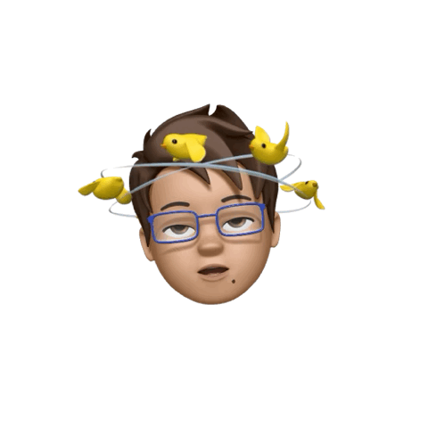

  

<table>
  <tr>
    <td width="140" valign="top">
      
    </td>
    <td valign="middle">
      <h1>Hi there, I'm Leonardo González 👋</h1>
      

        iOS Developer · Swift · SwiftUI | Computer Science Student at Instituto Tecnológico de Monterrey
      

    </td>
  </tr>
</table>

---

### 👨🏻‍💻 About me

- 🎓 7th semester **Computer Science** student at *Instituto Tecnológico y de Estudios Superiores de Monterrey*.
- 📱 I build **iOS apps** with **Swift & SwiftUI**, focusing on great UX and accessibility.
- 🌍 I enjoy working on apps that have **real impact** in health, education and productivity.
- 🗣 Native Spanish speaker, improving my **English** every day.

---

### 🚀 What I’m working on

- **Eyes 👁** – Visual health app  
  - Winner of the **Swift Student Challenge 2025** and took me to **Apple Park / WWDC**.  
  - Explains visual health concepts in a friendly way, using structured content and on-device intelligence.

- **HealthWind 🌬** – Air quality 
  - Uses **Core ML** + **SwiftData** to suggest habits based on air quality.  
  - Maps (**MapKit**), metrics, and health-focused insights.

- **Trionda ⚽** – 2026 World Cup travel companion  
  - Helps visitors plan routes, places and experiences for the World Cup.  
  - Uses  **MapKit**,  **Swift Data**, **Conectivity**, **Foundation Models**, and a data-driven architecture.

---

### Programming Languages

---

### Technologies

---

### 📊 GitHub Stats

  

  

---
